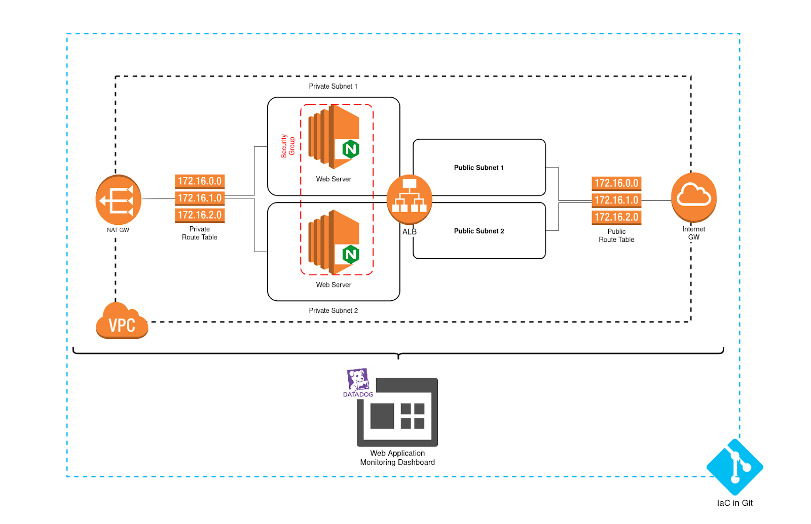

# Overview

This Terraform module deploys a complex infrastructure (AWS resources, Datadog monitoring, and a GitHub repository) for demo purposes.

* AWS Infrastructure - Networking (VPC, subnets, NAT Gateway, IGW, etc.), EC2 instances, and an ALB are deployed to support a simple NGINX application.
* Datadog - A basic Datadog monitoring dashboard is deployed, and Datadog is installed on the EC2 instance (via a user data script)
* GitHub - A GitHub repository (a clone of this template repository) is created and the necessary repository secrets are created to support day 2 operations via Cloudify

# Variables

The module takes the following variables.

* `app_name` - The name of the application that is being deployed. This is used to name resources (instances, GitHub repo, Datadog dashboard, etc.)
* `aws_access_key` - AWS access key ID used for authentication
* `aws_secret_key` - AWS secret key used for authentication
* `datadog_api_key` - Datadog API key. Used for authentication and agent configuration
* `datadog_app_key` - Datadog app key. Used for authentication and agent configuration
* `github_token` - GitHub token. Used to create repository
* `cloudify_host` - The host of the Cloudify manager. Used to configure secrets in the GitHub repository
* `cloudify_user` - A user to authenticate with the Cloudify manager. Used to configure secrets in the GitHub repository
* `cloudify_password` - The password for the `cloudify_user`. Used to configure secrets in the GitHub repository

# Outputs

The module exposes the following outputs:

* `lb_dns` - DNS endpoint of the ALB deployed in AWS
* `dashboard_url` - URL to access the Datadog dashboard for the application
* `repo_url` - URL for the GitHub repository that is created
